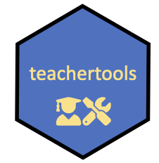

# teachertools

Collection on helper functions for teachers in quantitative fields

This repo provides tools for writing and grading exams/exercises, as well as publishing course materials.
The tools consists of R functions.
